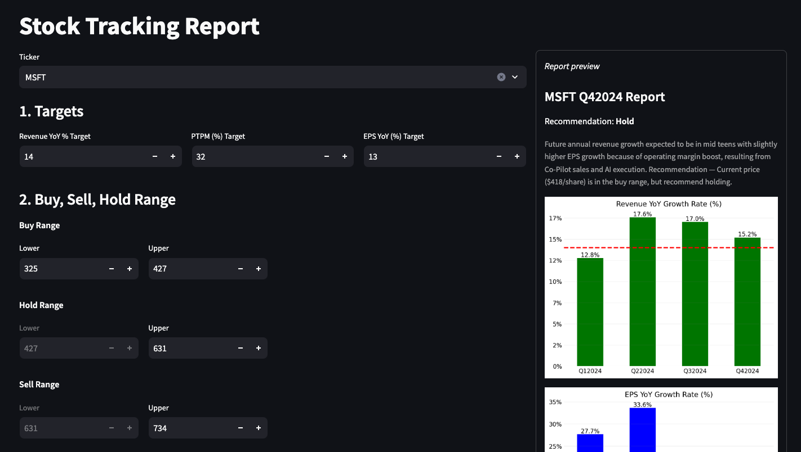

# Stock Report

Tool for generating reports on stocks held by the NC Triad Model Investment club.



To run it locally, you will need to get a [FMP](https://site.financialmodelingprep.com/developer/docs/dashboard) API key, store it in a `.env` file under `FMP_API_KEY` and then run:

```bash
pip install -r requirements.txt

streamlit run app.py
```